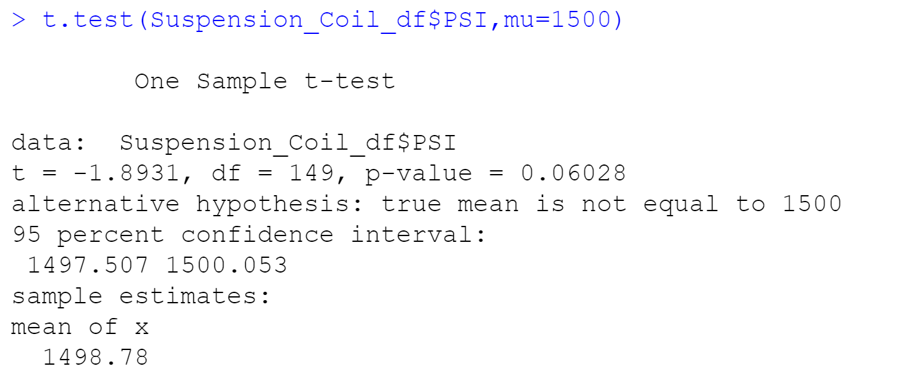
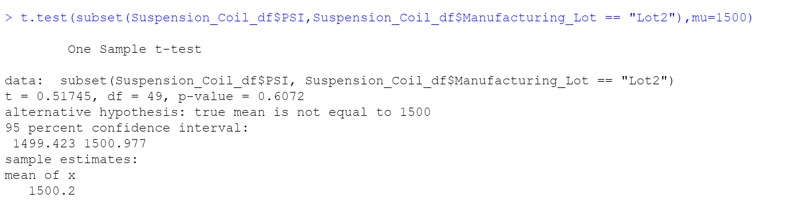
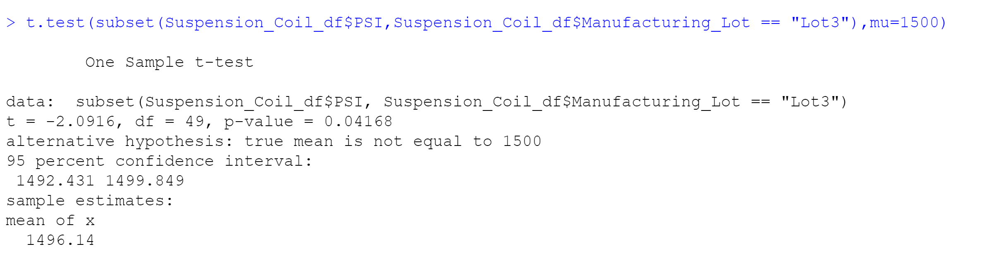

# MechaCar_Statistical_Analysis:  By David Matheny On: 3/26/2022

# Deliverable 1:  Linear Regression to Predict MPG (see pic below)

## Deliverable 1 Written Summary

## Linear Regression to Predict MPG

Which variables/coefficients provided a non-random amount of variance to the mpg values in the dataset?
Based off the summary statistics vehicle_length and ground_clearance are significant.

Is the slope of the linear model considered to be zero? Why or why not?
No, there appears to be a significant linear relationship. The estimate (aka slope coefficients) are not all zero.

				  Estimate Std. Error t value Pr(>|t|) 
vehicle_length    6.267e+00  6.553e-01   9.563 2.60e-12 ***
vehicle_weight    1.245e-03  6.890e-04   1.807   0.0776 .  
spoiler_angle     6.877e-02  6.653e-02   1.034   0.3069    
ground_clearance  3.546e+00  5.412e-01   6.551 5.21e-08 ***
AWD              -3.411e+00

Does this linear model predict mpg of MechaCar prototypes effectively? Why or why not?
It does seem that based off the summary statistics vehicle_length and ground_clearance are significant to MPG.  Also the r-value is 0.7149 and p-value: 5.35e-11 indicating correlation between our variables.

# Deliverable 2: Create Visualizations for the Trip

## Deliverable 2 Written Summary

## Summary Statistics on Suspension Coils

The design specifications for the MechaCar suspension coils dictate that the variance of the suspension coils must not exceed 100 pounds per square inch. Does the current manufacturing data meet this design specification for all manufacturing lots in total and each lot individually? Why or why not?
The total_summary only shows a variance of 62.29356 which is less than 100.  Individually in the lot_summary only Lot3 jumps out with a variance of 170.2861224, which is over 100.

# Deliverable 3: T-Tests on Suspension Coils

## Deliverable 3 Written Summary

## T-Tests on Suspension Coils

### Summary for All
Code: t.test(Suspension_Coil_df$PSI,mu=mean(Suspension_Coil_df$PSI))

For the summary of the t-test results across all manufacturing lots we have a mean of 1498.78.(The screeshots below displays mean of 1498.78)

### Lot1
Code: t.test(subset(Suspension_Coil_df$PSI,Suspension_Coil_df$Manufacturing_Lot == "Lot1"),mu=mean(Suspension_Coil_df$PSI))

Lot1 has a mean value of 1500(The screeshots below displays mean of 1500)

### Lot2
Code: t.test(subset(Suspension_Coil_df$PSI,Suspension_Coil_df$Manufacturing_Lot == "Lot2"),mu=mean(Suspension_Coil_df$PSI))

Lot2 has a mean value of 1500.2(The screeshots below displays mean of 1500.2)

### Lot3
Code: t.test(subset(Suspension_Coil_df$PSI,Suspension_Coil_df$Manufacturing_Lot == "Lot3"),mu=mean(Suspension_Coil_df$PSI))

Lot3 has a mean value of 1496.14(The screeshots below displays mean of 1496.14)

# Deliverable 4: Design a Study Comparing the MechaCar to the Competition

## Deliverable 4 Written Summary

## Study Design: MechaCar vs Competition
Short Description: To compare how MechaCar performs against the competition consumers would be interested in a variety of metrics like fuel efficiency, safety rating and cost.

What metric or metrics are you going to test?
I would test fuel efficiency as my #1(gas prices are so high right now that would be the most significant) then safety rating and cost.

What is the null hypothesis or alternative hypothesis?
The null hypothesis is that MechaCar average fuel efficiency is no different than its competition
The alternative hypothesis is that MechaCar average fuel efficiency is different than its competition

What statistical test would you use to test the hypothesis? And why?
Summary statistics and linear regression

What data is needed to run the statistical test?
We would need both the MPG city and highway data for both MechaCar and the competition.
